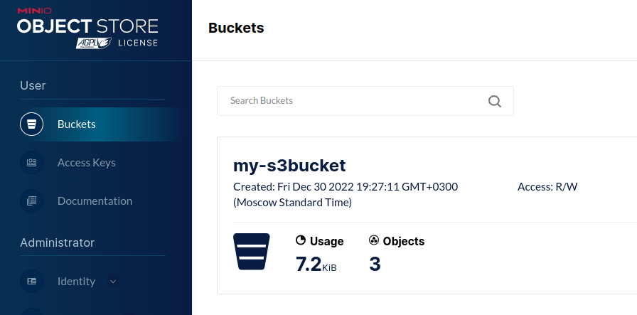
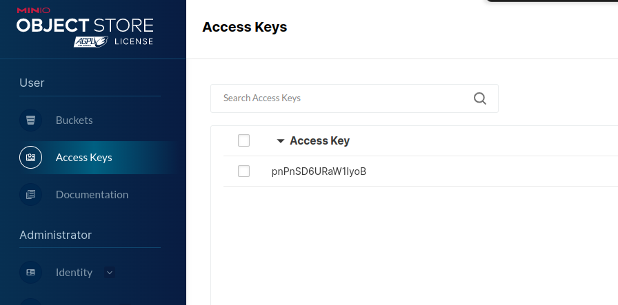
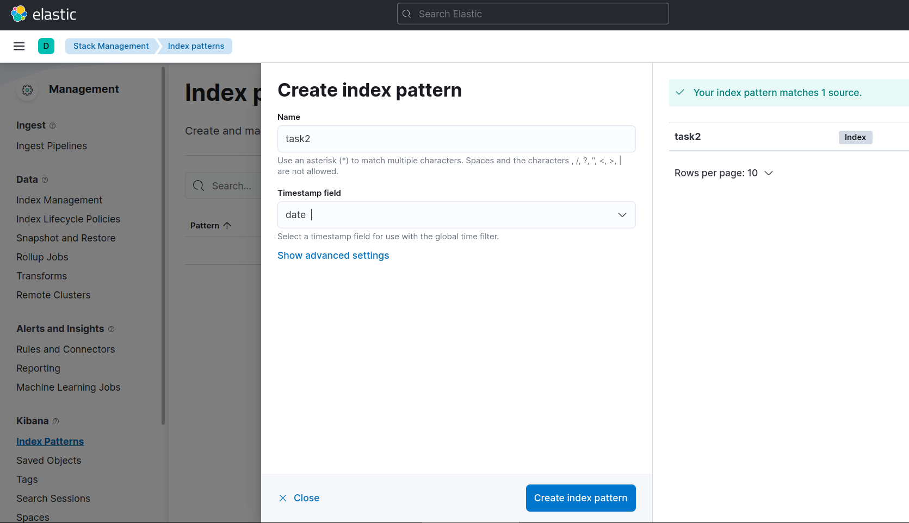
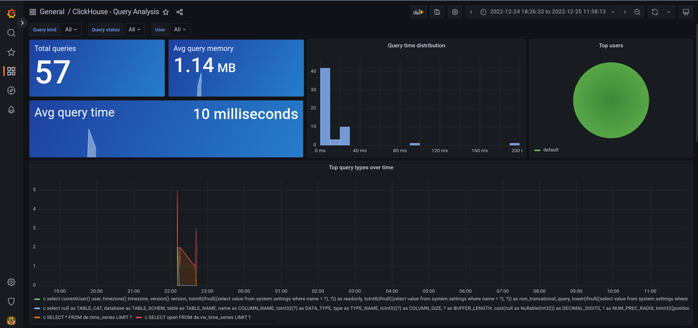

# Analysis of the currency market

<div align="center">


</div>

## General task
Create an ETL process for generating data marts to analyze changes in the exchange rate.

<details>
   <summary>Detailed task description</summary>

Develop data loading scripts in 2 modes:
- Initializing - loading a full source data snapshot
- Incremental - loading delta data for the past day

Organize the correct data storage structure

- Raw data layer
- Intermediate layer
- Showcase layer

As a result of the work of the software product, it is necessary to write a script that generates a data mart with the following content

- Currency name
- Total trading volume for the last day
- The exchange rate at the time of the opening of trading for a given day
- The exchange rate at the close of trading for the given day
- Difference (in %) of the exchange rate from the moment of opening to the moment of closing of trading for the given day
- The minimum time interval on which the largest trading volume for the given day was recorded
- The minimum time interval at which the maximum rate for the given day was fixed
- The minimum time interval at which the minimum trading rate for the given day was fixed

**Addition**:

As the basis of the showcase, you need to choose 5-10 different currencies or company shares.

**Sources**:

https://www.alphavantage.co/
</details>


## Implementation plan

The data from Alpha Vantage goes to the '/bronze' HDFS folder, where ClickHouse looks at it with its time_series table. The unique rows from this table are in the vw_time_series view, where Spark takes them from. After all the transformations, Spark puts the finished storefront in the '/gold' folder of HDFS and ElasticSearch. Various application settings are stored in the settings table in ClickHouse.


The entire environment will be installed on a local or virtual machine. In my case it is

- [Hadoop 3.2.1](https://hadoop.apache.org/docs/stable/hadoop-project-dist/hadoop-common/SingleCluster.html#Pseudo-Distributed_Operation) - needed to organize a data lake based on HDFS.
- [Airflow 2.5.0](https://airflow.apache.org/docs/apache-airflow/stable/start.html) - has a convenient graphical interface and the ability to write code in Python.
- [Spark 3.3.1](https://spark.apache.org/downloads.html) - fast data processing, better than MapReduce.
- [ClickHouse 22.11.2](https://clickhouse.com/docs/ru/getting-started/install/) - can be set to a folder in HDFS like in Hive Metastore. Makes quick selections.
- [HashiCorp Vault 1.12.3](https://www.hashicorp.com/products/vault) - tightly controls access to secrets and encryption keys

*(ClickHouse had to reconfigure port 9001 in /etc/clickhouse-server/config.xml because 9000 is taken by HDFS)*

ElasticSearch, Kibana and Grafana will come from [docker-compose.yml](./elasticsearch/)

Data storage structure:
- Raw data layer - folder '/bronze' in HDFS
- Intermediate layer - tables in ClickHouse
- Storefront layer - '/gold' folder in HDFS

## How Airflow works

Data loading scripts in 2 modes:
  - Initializing - downloading a full snapshot of source data for a month
  - Incremental - loading delta data for the past day


Description of steps:
1. **read_settings** - reading stocks to be loaded and other settings
1. **branch_operator** - checks the value of *time_series_interval* variable. If it is equal to INTRADAY, then there will be a reading for one day, otherwise for a month.
1. **download_intraday_time_series** - read data for one day from Alpha Vantage to HDFS folder '/bronze'
1. **download_monthly_time_series** - read one month data from Alpha Vantage to HDFS folder '/bronze'
1. **run_spark** - Spark reads this data from ClickHouse, builds a storefront, writes the result as a parquet file to the HDFS folder '/gold' and task2 index to ElasticSearch
1. **success** - message about successful completion of the task


## Database structure
- **time_series** - table with daily information
- **vw_time_series** - view with unique strings from time_series
- **settings** - various application settings


Initialization script [init.sql](./clickhouse/init.sql).

*(If the vw_time_series view will group for a long time, then you can try to create a table based on ReplacingMergeTree, where there will be only unique values by key. An example of such a script is [replace_view.sql](./clickhouse/replace_view.sql))*

## HDFS

### Initialization

```bash
hdfs namenode -format
start-dfs.sh
hdfs dfs -mkdir /bronze
hdfs dfs -mkdir /gold
hdfs dfsadmin -safemode leave
# if you need to stop, then stop-dfs.sh
```

### Structure

```bash
├── bronze  # raw data as csv files
└── gold    # finished showcases in the form of parquet files
```

## S3

You can use S3 instead of HDFS. For this we will use MinIO. Deployment settings are in [docker-compose.yaml](./s3/)

After starting, go to http://localhost:9011/, log in *airflow/airflowpass* and select **Buckets** in the menu on the left. Let's create a new bucket, let's call it **my-s3bucket**. After that, select the **Access Keys** item on the left and create an Access Key/Secret Key pair. We will need these keys when creating the **time_series_s3** table.

<details>
  <summary>Screenshots</summary>





</details>

To add the **time_series_s3** table, you need to substitute the Access Key and Secret Key in the [init.sql](./s3/) file and run this script. It will add a new table and change the object_storage parameter. Depending on this parameter, Airflow will store the result either in HDFS or in S3.

After that, it will be possible to reconfigure the current **vw_time_series** view to the new table.

You will also need to specify these keys in the DAG to access S3.

## HashiCorp Vault

Quick Start - https://developer.hashicorp.com/vault/docs/get-started/developer-qs

```bash
vault server -dev -dev-root-token-id="dev-only-token"

export VAULT_ADDR='http://127.0.0.1:8200'

vault kv put secret/KeyName ALPHAVANTAGE_KEY=_the_key_

vault kv get -field=ALPHAVANTAGE_KEY secret/KeyName
```

## Airflow

**pip** DAG packages
- clickhouse_driver
- apache-airflow
- alpha_vantage
- boto3
- hvac

<details>
  <summary>Initialization</summary>

```bash
# Airflow needs a home. `~/airflow` is the default, but you can put it
# somewhere else if you prefer (optional)
export AIRFLOW_HOME=~/airflow

# Install Airflow using the constraints file
AIRFLOW_VERSION=2.5.0
PYTHON_VERSION="$(python --version | cut -d " " -f 2 | cut -d "." -f 1-2)"
# For example: 3.7
CONSTRAINT_URL="https://raw.githubusercontent.com/apache/airflow/constraints-${AIRFLOW_VERSION}/constraints-${PYTHON_VERSION}.txt"
# For example: https://raw.githubusercontent.com/apache/airflow/constraints-2.5.0/constraints-3.7.txt
pip install "apache-airflow==${AIRFLOW_VERSION}" --constraint "${CONSTRAINT_URL}"

# The Standalone command will initialise the database, make a user,
# and start all components for you.
airflow standalone

# Visit localhost:8080 in the browser and use the admin account details
# shown on the terminal to login.
# Enable the example_bash_operator dag in the home page
```
</details>

## Development Results

As a result, a project was created with the following structure:

```bash
├── airflow         # source code for DAG
├── clickhouse      # scripts for ClickHouse
├── docs            # documentation, presentation
├── elasticsearch   # scripts for elasticsearch
├── images          # diagrams, pictures
├── mapreduce       # mapreduce example data mart
├── s3              # scripts for S3
└── spark           # source code for Spark
```
Data mart example:


## ElasticSearch, Kibana

To make it easier to see the results, Spark also uploads data to ElasticSearch in the **task2** index.

To install, use the *docker-compose.yml* script from the [elasticsearch](./elasticsearch/docker-compose.yml) folder

As a result, we get


Let's go to Kibana and add **index pattern** for our index on the **date** field of our **task2** index, which contains the quote date

The data from the Discover menu can then be sorted by all fields. For example, let's look at the data for the last five days

<details>
  <summary>Screenshots</summary>




</details>

## Grafana

You can also view the showcase in Grafana. It is installed by the same script as ElasticSearch.

The default login credentials are admin/admin.

### ClickHouse

You can install the plugin for [ClickHouse](https://grafana.com/grafana/plugins/grafana-clickhouse-datasource/) and then add it via *Data sources -> Add data source -> ClickHouse*

| Key | Value |
| ----------- | ----------- |
| Server address | host.docker.internal |
| Server port | 9001 |
| Username | default |
| Default database | de |

On the **Dashboards** tab, you can import various beautiful dashboards. For example, **Query Analysis**

<details>
  <summary>Screenshots</summary>




</details>

### Elasticsearch

And you can take data from **ElasticSearch**. It is also added via *Data sources -> Add data source -> Elasticsearch*

 Key | Value |
| ----------- | ----------- |
| URL | http://elasticsearch:9200 |
| Index name | task2 |
| Time field name | date |
| ElasticSearch version | 7.10+ |

If you click on the **Explore** button below, you can see that, for example, on December 22 and 23, information on four stocks/currencies was uploaded

<details>
  <summary>Screenshots</summary>


</details>